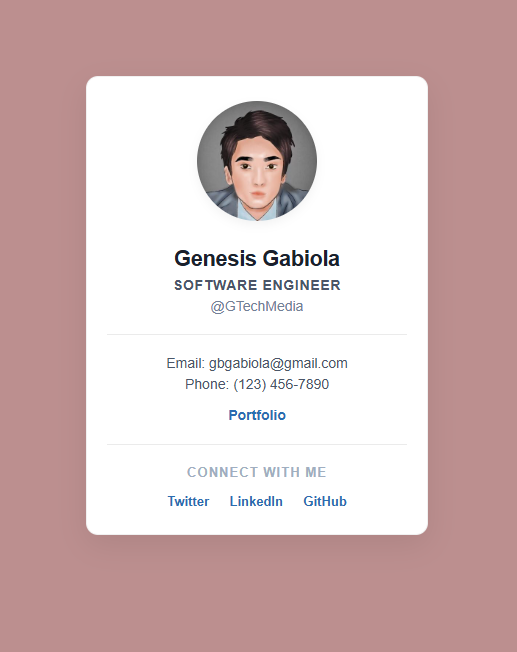

# Personal Business Card

A sleek, professional, and minimalist digital business card component designed to present essential professional contact information and social networking links.

## 🚀 Live Links

- **Production Site:** [View Live on GitHub Pages](https://gbgabiola.github.io/sandbox/business-card)

## 📸 Preview

## 🛠️ Tech Stack

- HTML5
- CSS3

## 🤝 Feedback & Contributing

Contributions, bug reports, and design suggestions are highly welcome!

- **Technical Issues:** Feel free to open a detailed bug report or feature request via [GitHub Issues](https://github.com/gbgabiola/sandbox/issues).
- **Get in touch:** Connect or chat with me on [LinkedIn](https://www.linkedin.com/in/gbgabiola) for collaborations.

## 🎓 Acknowledgements

- Inspired by modern digital interface mockups and clean structural component design guidelines across frontend software engineering.
