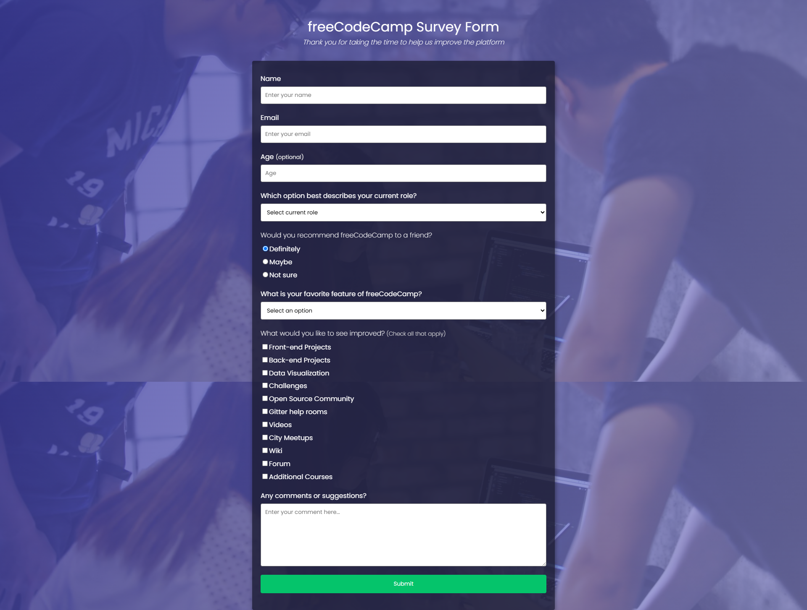

# FCC Survey Form

A clean, modern, and fully responsive survey form designed to gather feedback from developers to help improve the [freeCodeCamp](https://freecodecamp.org) educational platform.

This project demonstrates semantic HTML5 elements and custom CSS3 styling. It was built as one of the required projects for the **freeCodeCamp Responsive Web Design Certification**.

## 🚀 Live Links

- **Production Site:** [View Live on GitHub Pages](https://gbgabiola.github.io/sandbox/fcc-survey-form)
- **Interactive Playground:** [Explore CodePen Sandbox](https://codepen.io/gbgabiola/full/mdJXoow)

## 📸 Preview

## ✨ Key Features & Technical Goals

- **Responsive Design:** Fluid layout optimized for desktops, tablets, and mobile screens.
- **Semantic HTML:** Implements modern form elements according to accessibility best practices.
- **Form Validation:** Native browser validation for required fields, email formatting, and numeric ranges.
- **Custom Styling:** Tailored user experience featuring modern typography, input focus states, and a clean UI hierarchy.

## 🛠️ Tech Stack

- HTML5
- CSS3

## 🤝 Feedback & Contributing

Contributions, bug reports, and design suggestions are highly welcome!

- **Technical Issues:** Feel free to open a detailed bug report or feature request via [GitHub Issues](https://github.com/gbgabiola/sandbox/issues).
- **Get in touch:** Connect or chat with me on [LinkedIn](https://www.linkedin.com/in/gbgabiola) for collaborations.

## 🎓 Acknowledgements

- Thanks to [freeCodeCamp](https://freecodecamp.org) for providing the structural prompt and project requirements.
