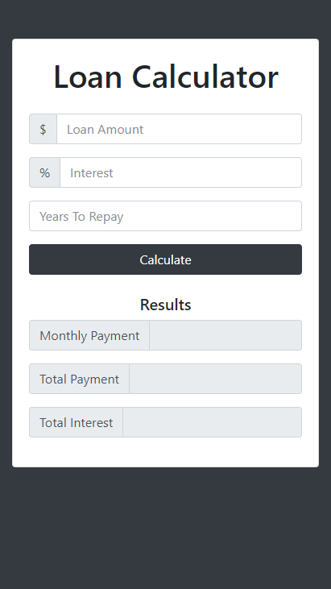

# Loan Calculator

A loan calculator to quickly show the clients how long it would take to pay a loan back, how much interest or total amount would be and etc.

## Built with:

- HTML5
- Bootstrap 4
- JavaScript

Visit the [live preview](https://genesisgabiola.github.io/sandbox/loan-calculator).

<!-- ## Future Improvements:

- [ ] 
- [ ] 
- [ ] 
 -->

## How to Contribute?

Choose what you prefer:

- Open an [issue](https://github.com/genesisgabiola/sandbox/issues).
- Contact me on [twitter](http://twitter.com/genesisgabiola).

Any queries, suggestions, issues to report or critics are welcome :) You can freely connect to me.
