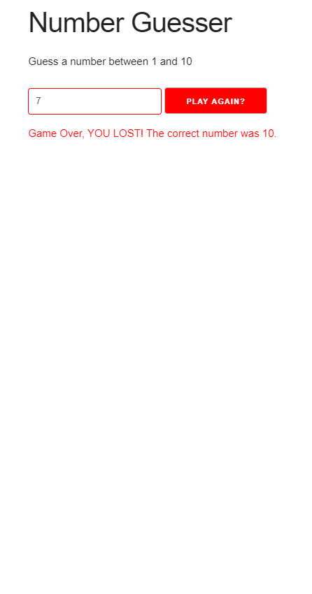

# Number Guesser

## Game Function

- Player must guess a number between a min and max
- Player gets a certain amount of guesses
- Notify player of guesses remaining
- Notify the player of the correct answer if loose
- Let player choose to play again

## Built with:

- HTML5
- Skeleton CSS
- JavaScript

Visit the [live preview](https://genesisgabiola.github.io/sandbox/number-guesser).

<!-- ## Future Improvements:

- [ ] 
- [ ] 
- [ ] 
 -->

## How to Contribute?

Choose what you prefer:

- Open an [issue](https://github.com/genesisgabiola/sandbox/issues).
- Contact me on [twitter](http://twitter.com/genesisgabiola).

Any queries, suggestions, issues to report or critics are welcome :) You can freely connect to me.
