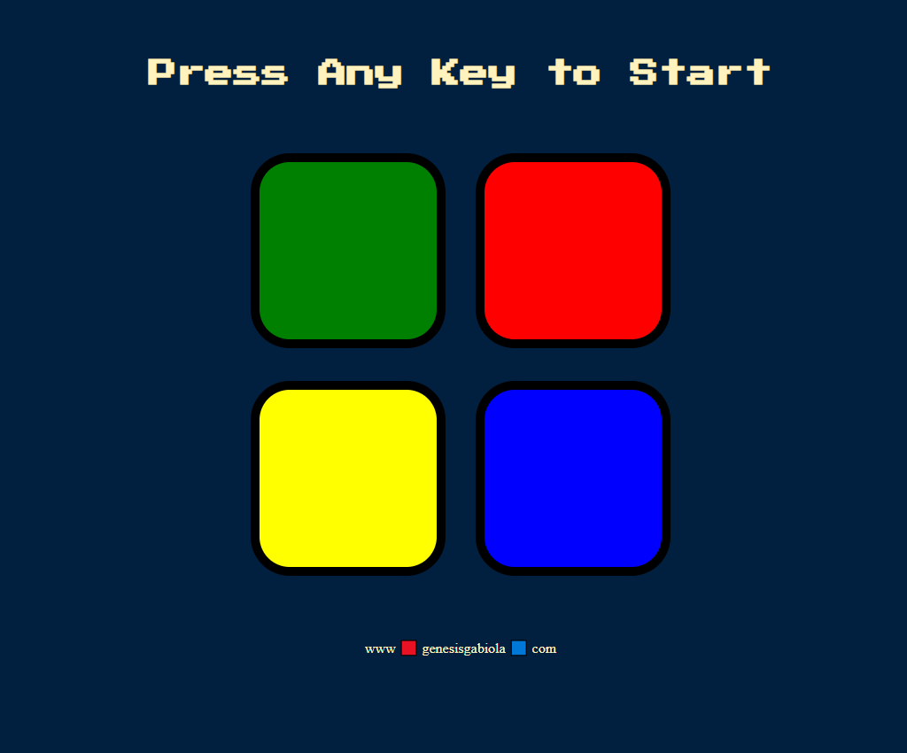

# The Simon Game

Simon Game is a classic electronic game and this is the online version of it. This game creates a series of tones and light and requires a user to repeat the sequence.

## Built with:

- HTML5
- CSS3
- JavaScript
- jQuery

Visit the [live preview](https://genesisgabiola.github.io/sandbox/simon-game).

## Future Improvements:

- [ ] Improved the ui/ux design of the app.
- [ ] Add some more animations on it.
- [ ] Add some other functions like, non-strict/strict option or turn on and off option.

## How to Contribute?

Choose what you prefer:

- Open an [issue](https://github.com/genesisgabiola/sandbox/issues).
- Contact me on [twitter](http://twitter.com/genesisgabiola).

Any queries, suggestions, issues to report or critics are welcome :) You can freely connect to me.